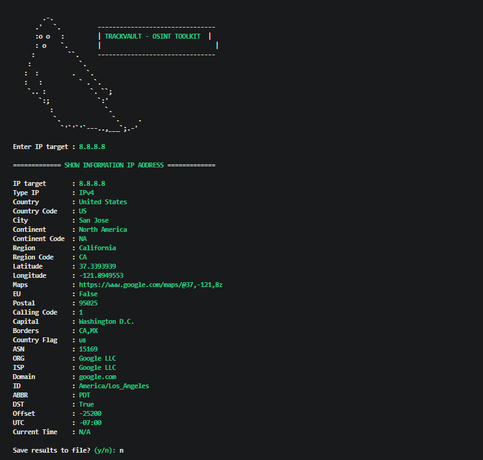
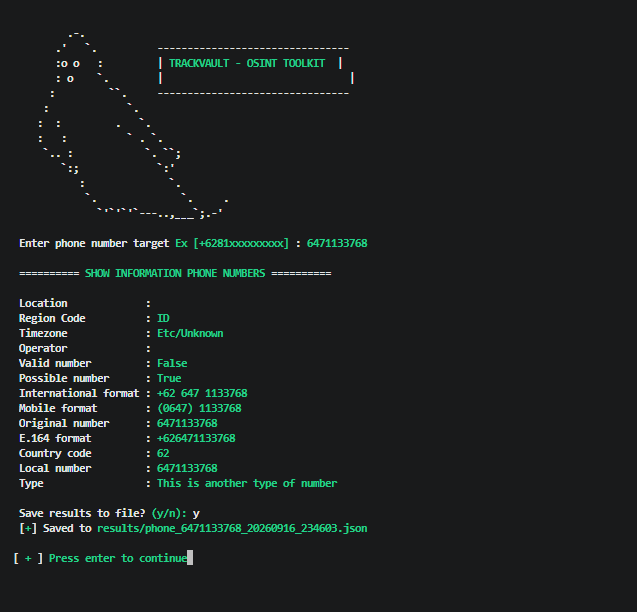
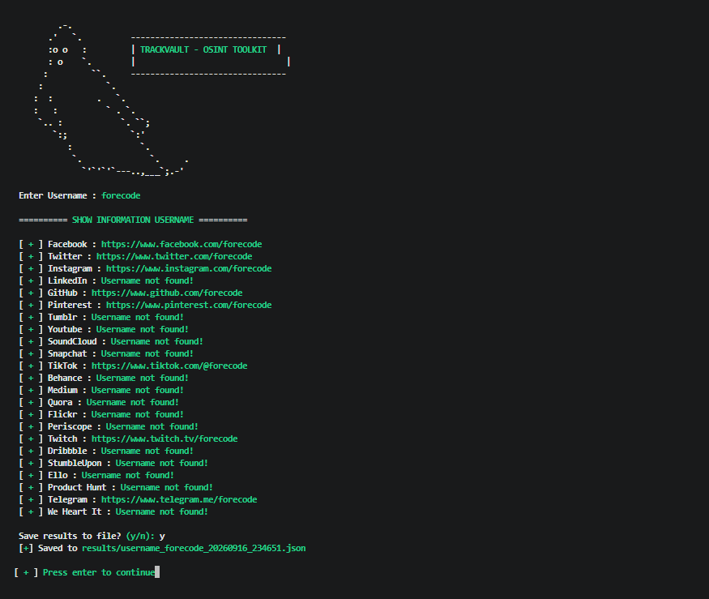

# TrackVault
A handy OSINT tool to track location or mobile number, so this tool can be used for information gathering.


New update:
```Version 2.2```

### Installation on Linux (deb)
```
sudo apt-get install git
sudo apt-get install python3
```

### Instalation on Termux
```
pkg install git
pkg install python3
```

### Usage Tool
```
git clone https://github.com/avitajbhangu07-spec/TrackVault.git
cd TrackVault
pip3 install -r requirements.txt
python3 GhostTR.py
```

Display on the menu IP Tracker



Display on the menu Phone Tracker



on this menu you can search for information from the target phone number

Display on the menu Username Tracker



on this menu you can search for information from the target username on social media

Features
IP address lookup with geolocation, ISP, ASN info
Phone number lookup (carrier, region, validity)
Username search across 20+ social platforms
Save any lookup result to a timestamped JSON file

